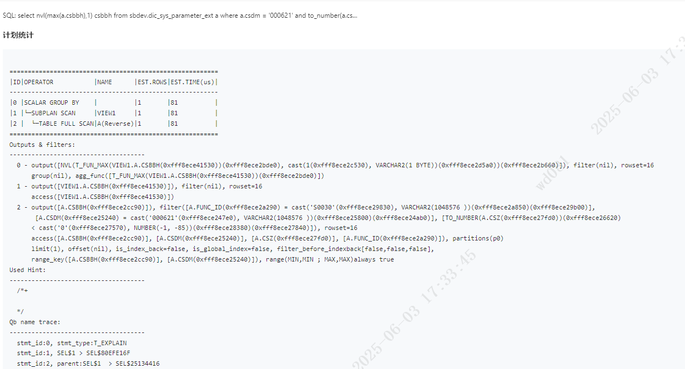
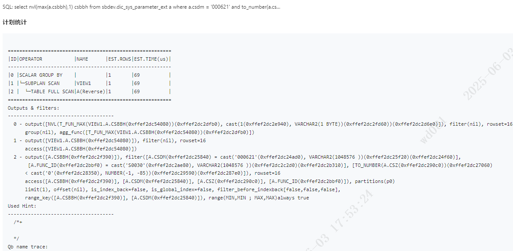
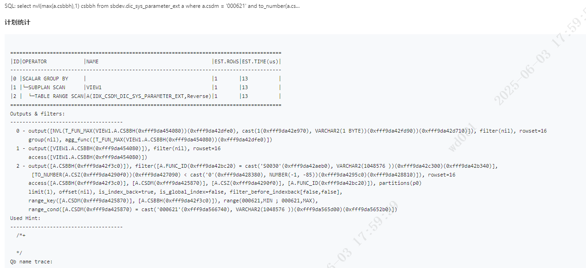

# 问题现象
在oceanbase 4.2.5版本当中，如下sql不会报错:
```
select nvl(max(a.csbbh),1) csbbh from sbdev.dic_sys_parameter_ext a where a.csdm = '000621' and to_number(a.csz) < '0' and a.func_id = 'S0030'
```
其中，to_number(a.csz)在ob 4.3.5.1中报错，报错代码:
OBE-01722:invalid number  
在4.2.5中，没有报错
## 版本区别
4.2.5中，sql语句执行计划如下:
  
4.3.5.1中，该语句执行计划如下:


可以看到执行计划没有区别，都是走的TABLE FULL SCAN扫描
### 解决方法
参考官方的帖子:
https://www.oceanbase.com/knowledge-base/oceanbase-database-1000000000532680?back=kb  
帖子中有提到:
OceanBase 数据库 V2.x 和 V3.x 版本会最大化抽取 EXEC_PARAM，TO_NUMBER('eee') 不满足函数要求，因此报错。而 Oracle 数据库以及 OceanBase 数据库 V4.x 版本均最小化抽取 EXEC_PARAM，且包含恒 false 条件的子查询会被改写为 Null，因此不会报错。
因此，合理的怀疑,在ob4.3.5.1版本当中，在全表扫描的过程中，同样扫描到了不符合to_number转换的字段数据。
因此，解决思路就是让sql运行中先通过其他字段输出结果集之后，再进行to_number转换过滤。
```
create index sbdev.idx_csdm_DIC_SYS_PARAMETER_EXT on sbdev.DIC_SYS_PARAMETER_EXT(CSDM);
```
添加字段索引之后，执行计划如下:

可以看到，扫描方式变更为table range scan，选择了新建的索引，并且is_index_back 变为true，相较于原来有了索引回表，问题解决